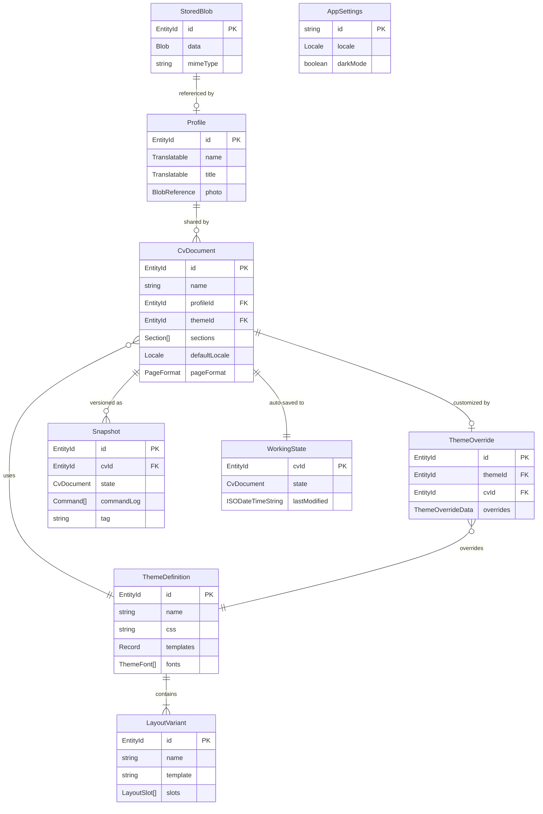

# Relationships Diagram

## Relationship Summary

- **Profile 1 -> N CvDocument**: One profile can be shared across many CVs. A CV references a profile by `profileId` and may apply partial overrides.
- **CvDocument 1 -> N Snapshot**: Each CV accumulates immutable snapshots over time. Snapshots are ordered by `timestamp`.
- **CvDocument 1 -> 1 WorkingState**: Each CV has exactly one working state slot, overwritten on each auto-save.
- **CvDocument N -> 1 ThemeDefinition**: Many CVs can use the same base theme.
- **CvDocument 1 -> 0..1 ThemeOverride**: Each CV has at most one theme override record (its per-CV customizations).
- **ThemeDefinition 1 -> N LayoutVariant**: A theme contains one or more layout variants. Stored inline within `ThemeDefinition.layouts`, not as separate database entities.
- **Profile / CvDocument -> StoredBlob**: Blob references (e.g., `photo`) point to entries in the `blobs` table by ID.
